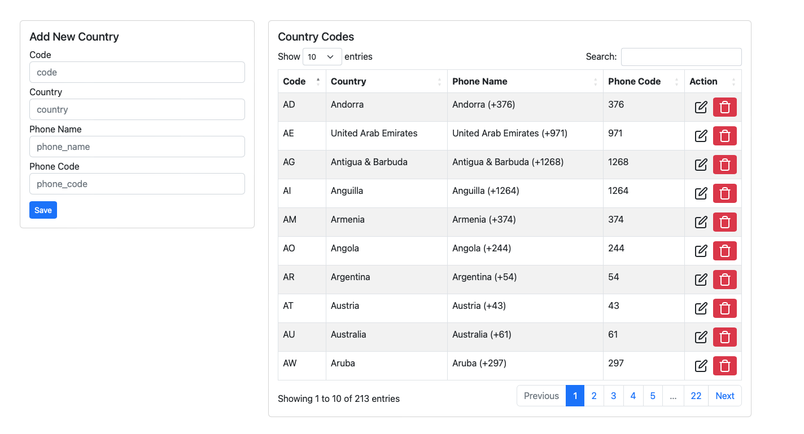

# Country Codes

This is a Composer plugin that provides an automated version of Country Codes database.

This database is include: `country iso codes`, `country names`, `country names with phone codes`, `phone codes` as well as admin page to manage your list of data.





## What you can do?

- [x] Get users country names
- [x] Get users phone numbers
- [x] Send OTP codes
- [x] Send message on messangers

_Usage of this package are vary, those were just small examples of what you can do._

Also my main reason to build this package was to send WhatsApp message (specifically OTP codes).

## Table Of Contents

* [Installation](#installation)
* [Usage](#usage)
* [Customization](#customization)
* [Contributing](#contributing)
* [License](#license)

## Requirements

|  Source | Version |
| :--- | ---: |
| Composer  | ^2.0  |
| PHP  | ^7.4/^8.0  |

## Installation

The only thing you need to do to make this work is adding this package as a dependency to your project:

```BASH
composer require irando/country-codes
```

## Usage

1. Add following line in your `config/app.php` file

```PHP
'providers' => [
    // ...
    Irando\CountryCodes\CountryCodesServiceProvider::class,
];
```

2. Run either of commands below to publish package files

```PHP
php artisan vendor:publish
```
And select id referred to:
```PHP
Irando\CountryCodes\CountryCodesServiceProvider
```
OR
```PHP
php artisan vendor:publish --tag=country-codes
```

3. Run `php artisan migrate` to add countries table into your database
4. Run `php artisan db:seed --class=CountryCodesTableSeeder` to seed countries data into countries table.

> Note: In case of error after this command run `composer dumpautoload` and try again to seed database


> Now visit `your_url.tld/country-codes` and you are set.


## Customization

If you need _(probably you do!)_ to customize the look, routing, functionality etc. of this package, at stage 2 of installation we deployed `CountryCodes.php` which is your table model, as well as view files at `resources/views/vendor/irando/country-codes` you can edit those files and create your own.

## Contributing

All feedback / bug reports / pull requests are welcome.

### You can support me for more open source projects by sponsoring this package

## License

This code is released under the MIT license.

For the full copyright and license information, please view the [`LICENSE`](LICENSE) file distributed with this source code.

> Developed by [Robert Nicjoo](https://github.com/robertnicjoo)
